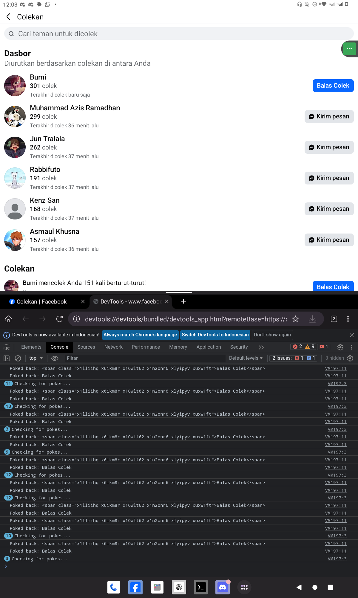
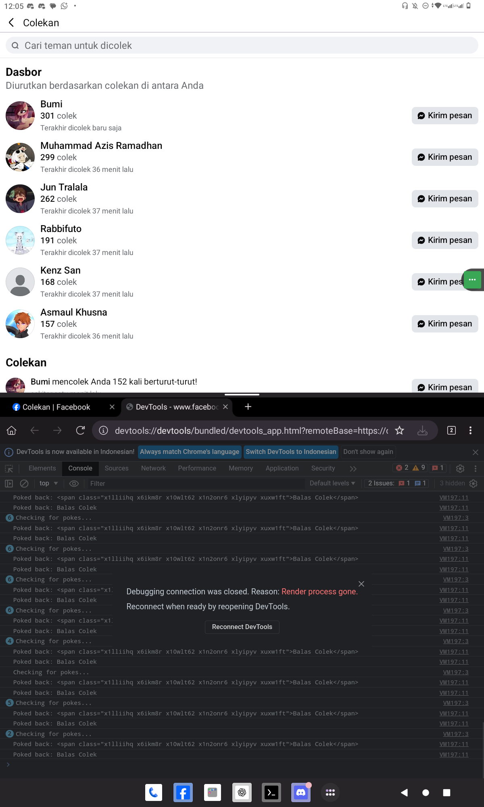

# pokecolek-pokemak-BFB
Skrip automatisasi colek mencolek mempokemak di Fesnuk lebih responsif sesuai tombol sudah di klik (antibanned) oleh Marek Zuckerbergies (⁠ ⁠╹⁠▽⁠╹⁠ ⁠)

pokecolek-pokemak-BFB
Skrip otomatisasi colek-mencolek di Facebook yang lebih responsif! Skrip ini memastikan bahwa colek hanya dilakukan saat sudah ada yang mencolek terlebih dahulu, sehingga mengurangi risiko deteksi otomatis oleh sistem.

Fitur Utama
Responsif: Tidak ada penundaan yang tidak perlu, hanya mencolek balik saat sudah dicolek.
Antibanned: Menghindari spam dengan hanya bertindak sesuai kebutuhan.
Mendukung berbagai perangkat: Bisa dijalankan di browser Kiwi (Android) maupun browser desktop seperti Chrome dan Firefox.

Cara Menggunakan

1. Unduh atau salin skrip berikut sesuai bahasa yang diinginkan:
  - Bahasa Indonesia: colek.js
  - English Version: poke.js

2. Buka Facebook di browser Kiwi atau browser desktop dengan fitur Inspect Console.
3. Tempelkan skrip ke dalam Console dan jalankan.
4. Skrip akan secara otomatis mencolek balik setiap kali ada yang mencolek Anda.  

Screenshot

Berikut beberapa contoh tampilan saat skrip berjalan:
| Screenshot | Deskripsi |
|------------|------------|
|  | Tampilan Facebook di Kiwi Browser dengan Inspect Console terbuka |
|  | Situasi ketika Console tiba-tiba menghilang |
|  | Tampilan di browser Chrome/Firefox pada Windows |
|  | Tampilan di browser Chrome/Firefox pada Linux |

Catatan
Skrip ini dibuat hanya untuk hiburan dan kemudahan pengguna. Gunakan dengan bijak agar tidak melanggar kebijakan Facebook!

---

© 2025, pokecolek-pokemak-BFB by Archana Berry
